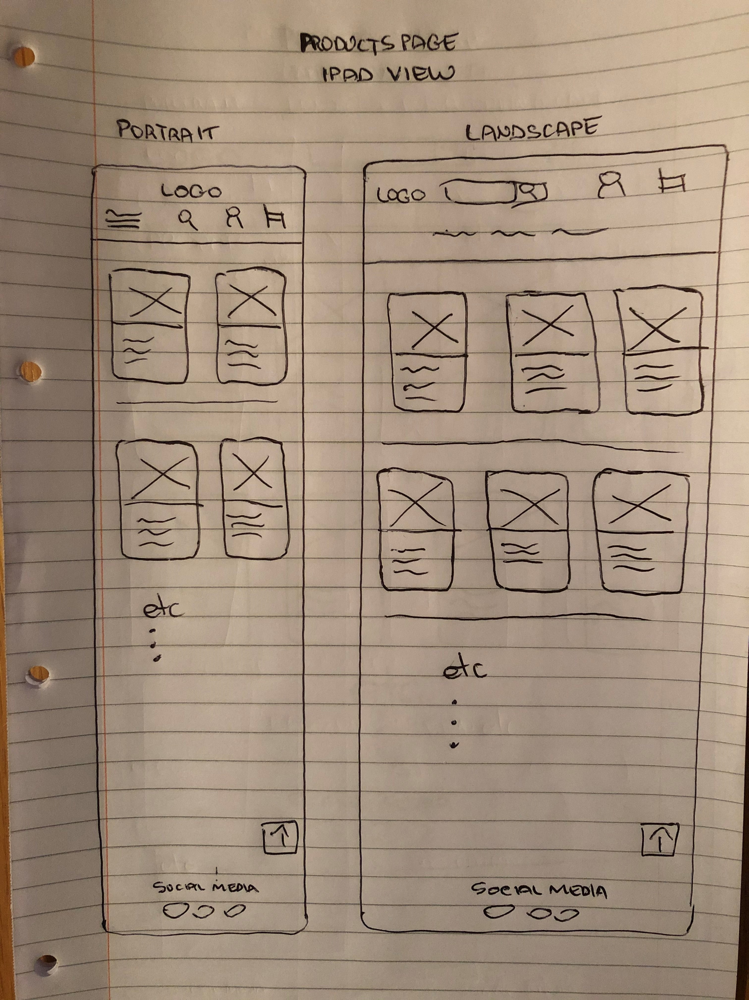
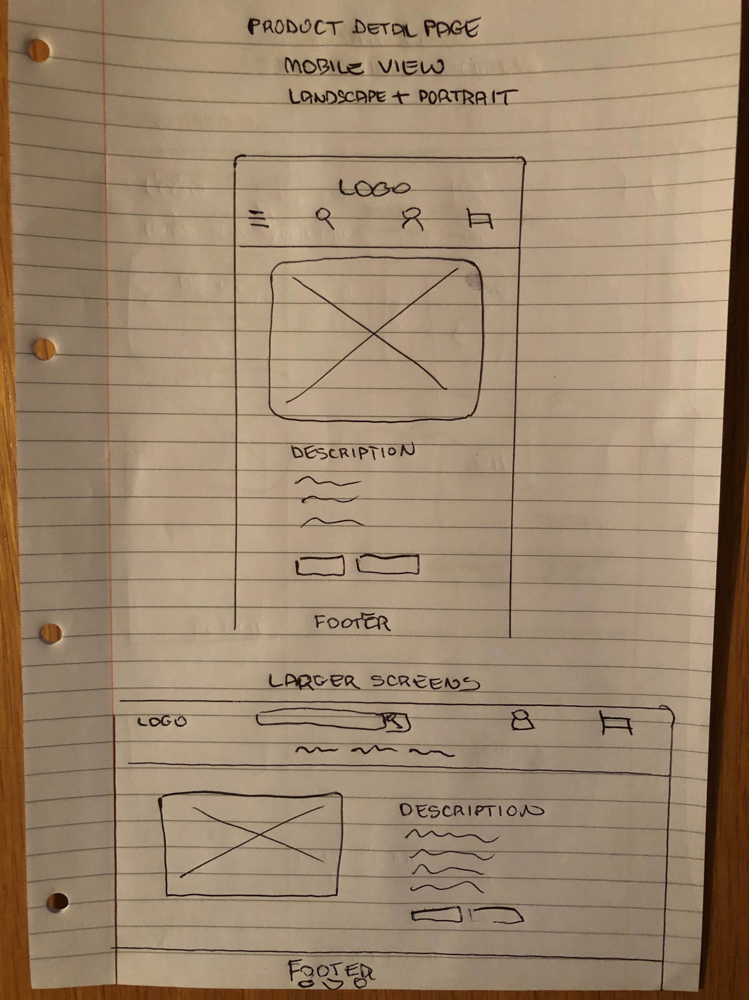

# That Awkward Artist

# Contents
1. <a href="#Demo">Demo</a>
1. <a href="#UX">UX</a>
    * <a href="#ProjectGoals">Project Goals</a>
    * <a href="#UserStories">User Stories</a>
    * <a href="#Strategy">Strategy</a>
    * <a href="#Wireframes">Wireframes</a>
1. <a href="#Features">Features</a>
    * <a href="#FeaturesLeft">Possible Future Features</a>
1. <a href="#Technologies">Technologies</a>
1. <a href="#Testing">Testing</a>
1. <a href="#Deployment">Deployment</a>
    * <a href="#GitHubPages">GitHub Deployment</a>
    * <a href="#Heroku">Heroku Deployment</a>
    * <a href="#ProjectLocally">To run this project locally</a>
1. <a href="#Credits">Credits</a>
    * <a href="#Content">Content</a>
    * <a href="#Media">Media</a>
    * <a href="#Acknowledgements">Acknowledgements</a>
1. <a href="#Disclaimer">Disclaimer</a>

<h2>4th Milestone Project: Full Stack Frameworks with Django - Code Institute</h2>

This website is based on using Django (a high-level Python Web framework) and Stripe (a payment processing platform)
to build an ecommerce website.

<h1 id="Demo">1. Demo</h1>

A live demo can be found <a target="_blank" href="https://thatawkwardartist.herokuapp.com/">here.</a>

<h1 id="UX">2. UX</h1>
<h2 id="ProjectGoals">Project Goals</h1>

**Target Audience**
* People who love high quality artwork
* People who collect high quality artwork
* People who love music and films
* People who want to get a portrait drawn

**User Goals**
* View the artists artwork and any other projects she is working on 
* The reason why she drew each artwork
* Purchase artwork in a safe and secure way

**Business Goals**
* To make a profit from selling her artwork
* To increase her target audience worldwide
* To provide users with a secure ecommerce website

<h2 id="UserStories">User Stories</h1>

* Viewing and Navigation

    * As an artist purchaser, I want to view a list of artwork so that I can select one or more to purchase
    * As an artist purchaser, I want to view a individual artwork details so that I can view more information on it
    * As an artist purchaser, I want to view the total of my purchases at any time details so that I know how much I'm going to spend
    
* Registration and User Accounts    
    * As a site user, I want to easily register for an account so that I can have a personal account and view my profile
    * As a site user, I want to easily recover my password in case I forgot it so that I can gain access my personal acocunt
    * As a site user, I want to recieve an email confirmation after egistering so that I can verify my registration was successful
    * As a site user, I want to have a personalized user profile so that I can view my personal order history, order confirmation and save to payment information
* Sorting and Searching
    * As an artist purchaser, I want to sort the list of available products so that I can easily identify the artwork in category order, in price order or in size order 
    * As an artist purchaser, I want to sort a specific category of product so that I can find the best priced, the size or alphabetically
    * As an artist purchaser, I want to sort to search for a product by name or description so that a can find a specific artwork I want
    * As an artist purchaser, I want to easily see what I've searched for and the number of results so that I can quickly see if the artwork I want is there
* Purchases and Checkout
    * As a purchaser, I want to view items in the shopping cart to be purchased so that I can maske sure what i am purcashing and identify the total cost of all items
    * As a purchaser, I want to easily delete any item in the shopping cart so that I can make changes before checkout
    * As a purchaser, I want to feel my personal and payment information is safe and secure so that I can confidently provided the required information
    * As a purchaser, I want to view an order confirmation after checkout so that I can verify I haven't made any mistakes
    * As a purchaser, I want to recieve an email confirmation after checking out so that I can keep it for my records
* Administration
    * As a store owner, I want to add an artwork so that I can add new artwork to the website
    * As a store owner, I want to edit/update an artwork so that I can change prices, descriptions and images
    * As a store owner, I want to delete an artwork so that I can remove items already sold

<h2 id="Strategy">Strategy</h2>

The overall strategy for visitors to this website is for them to purchase artwork and to set up a profile in order to view past orders, 
to save delivery and payment information with the possibility of returning to the website to purchase again. My goal in the design of 
this website was to keep it very simple, to make it easy to navigate and easy on the eye.
As soon as you open the website you will see an image of the logo in the Navbar which I find is eye catching and will navigate back to the homepage when clicked..... 
I designed the logo on <a target="_blank" href="https://placeit.net/">www.placeit.net</a> and 
chose a purple for the background as it blends in with the rest of the website, with white text for it to stand out. I chose the image of the art palette ad paint brush to emphasise that the website is an artists website. 
I used <a target="_blank" href="https://color.adobe.com/create/color-wheel/"> colour wheel</a>
and selected mainly different shades of purple for the basis of the website pages as purple is Anni Sweeneys (the artist) favourite colour.
I selected three shades of purple consistently throughout the website so as not to overpower the website with too many colours.
I have used <a target="_blank" href="https://fonts.google.com/">Google Fonts</a> to select the Roboto font 
in the website as this is by far one of the most popular and readable fonts to use in websites.

<h2 id="Wireframes">Wireframes</h2>

<h3>Wireframes for mobile devices</h3> 

<h3>Wireframes for tablet devices</h3> 

<h3>Wireframe for desktop devices</h3> 

<h1 id="Features">3. Features</h1>
That Awkward Artist comprises of a Homepage (with contact form), products page, shopping cart page, checkout page and profile page

<h2>Navbar</h2>
I have used a responsive navigation bar using bootstrap.  
For mobile devices, the logo will remain at the top for easy navigation back to home page. A hamburger menu on the top-left expands a menu with links to 
the different paintings by price, type and size. A search button, my account button for login/register and a shopping cart button. On larger 
devices the expanded menu is shown instead with the logo on the right, a search bar in the middle, my account button for login/register and a shopping cart button and 
below these is  dropdown menus for all paintings, types and sizes. I feel this will be easy for users to 
quickly navigate the website. This navbar will be fixed at the top for easy navigation at all times.

<h2>Footer</h2>
The footer contains links to social media.

<h2>Contact Form and EmailJS</h2>
I included a contact form with 5 required fields (name, email, type, size and query) 
that when completed correctly will send an email to myself and an auto reply email
to the sender using <a target="_blank" href="https://www.emailjs.com/">EmailJS</a>. 
If one or more of the fields are not completed correctly, website visitor will be advised and
will not be able to send until all fields completed. A message will appear when form completed correctly and submitted saying "Email sent successfully!"

<h2>Carousel</h2>
On the homepage, the first thing you will see is a carousel of images relating to the Artists artwork in different forms. This will hopefully entice the user to scroll through the products page.

<h2>All Paintings Page</h2>

* The All Paintings page displays product cards, including the following information: name, size, price and category. 
When the image of each painting is clicked, the user is redirected the individual painting page with detailed information.

* If the user is admin, there are also 2 buttons displayed in the cards: Edit and Delete. Clicking Edit button redirects 
admin to the Edit Product page. Clicking the Delete button deletes the product. The page reloads and the toast message 
will inform about the successful deletion. These actions can be done only by superuser, attempts to access them by other 
users will end up redirected to the homepage with toast error messages displayed.

* I have included the sort options on each all paintings page which can be sorted by price, name and category. 

<h2>Painting Detail Page</h2>

* The painting details page displays information about the selected painting: category, name, description, price and product image. Clicking the image will open it in the new tab dispacing it full screen.

* The user will only be allowed to add 1 of each painting, but have kept the quantity box included in case she has completes multiple copies of paintings in the future.

* A painting can be added to the cart by clicking Add to cart button, that will be reflected in the cart icon in the navbar (grand total will be increased). 
The toast success message will be displayed when the product is added to the cart.

* If the user is admin, there are also 2 buttons displayed on this page: Edit and Delete. Clicking Edit button redirects 
admin to the Edit Product page. Clicking the Delete button deletes the product. The page reloads and the toast message 
will inform about the successful deletion. These actions can be done only by superuser, attempts to access them by other 
users will end up redirected to the homepage with toast error messages displayed.

<h2>Shopping Cart Page</h2>
* I ahve 2 options at the bottom, keep shpping which will redirect the user back to all products page or secure checkout which will send the user to the checkout page.  

* Cart page is available for both logged in and non-logged in users, so that it is possible to make purchase being a guest.

* The page contains a summary of the user's order: image, name, size, sku, quantity, price, subtotal and grand total with a 
remove button in case they want to delete a painting. A toast message will be displayed when a user removes an item from the shopping cart.

<h2>Checkout Page</h2>

* This includes an order summary consisting of image, name, quantity, subtotal and grand total.

* The checkout form requires personal details, delivery details and payment details.

* If a user already has a profile with the shipping information saved, the form will be pre-populated with this information.

* If a required field is not completed, the user will be advised.

* After completing personal and delivery details, the user has the option to create an account or login in order to save these details.

* The user is informed how much the card will be charged below the complete order button.

* Since the website is made for educational purposes only and the Stripe functionality is only for testing, only 4242 4242 4242 4242 
card number will lead to the successfull payment. The user is asked to provide card number, expiration date (any date in future), 
CVC (any numbers) and 5 digit postcode (any 5 digits).

* If an incorrect number is used, the user will be advised by way of a message below the payment details.

* A webhook is used to make sure that the order is processed even in the cases when the payment process is interrupted 
(eg if a user accidentally closes the page or browser after clicking "complete order" button).

* Once the form is submitted and the payment is successfully proceeded, the Checkout sucesss page is loaded and a confirmation 
email is sent to the user's email. Also, a toast message appears to ensure the user that the order was processed successfully.

<h2>Checkout Success Page</h2>

* The paragraph with a Thank you message is displayed on the top of the page to inform a user that the payment was 
processed and the email was sent to the user's email.

* The 3 sections Order info, Shipping details and Order Summary contain all the information about the completed order.

* Keep shopping button redirects user to the All Paintings page.

<h2>Profile Page</h2>

* Once registered or signed in, the user can update your mobile number and delivery address.

* They can also view their order history (Order Number,	Date, Items and Order Total)

<h2>Admin</h2>

Product managment feature is available only for superusers. Admin page allows an owner of the 
website to add new paintings by filling out a form on the Product Management page. If the form is valid, 
the painting is added to the database and the user is redirected to the newly created paintings details page. 
The defensive design is implemented to restrict other than admin users to manually enter the url to get access 
to the page. User will be redirected to the home page with the toast error messages appeared. 

<h2>Django-allauth</h2>

Django allauth has all the standard features including...

* Sign up - requires username, email, password twice and an email will be sent with a verification link

* Login - requires either username or email and password with a toast message confirming successfully signed in

* Logout - Once completed logout, a toast message confirming successfully logged out

* Forgot password - requires email and email will be sent to link to update password

<h2 id="FeaturesLeft">Possible Future Features</h2> 
- unable to do due to time constraints

* To be able to signup/login through social media acounts eg facebook and google  
* When a painting is purchased, to be able to automatically delete that painting from the website.
* Add a proper flash message when submit button is pressed in the contact us form to advise that it was
completed (as well as receiving a confirmation email - already in place).
* To use crispy forms instead of emailjs for the contact form to partially autocomplete when a user is signed in

<h1 id="Technologies">4. Technologies</h1>
<h2>Language Used</h2>

* <a target="_blank" href="https://en.wikipedia.org/wiki/HTML">HTML</a>
* <a target="_blank" href="https://en.wikipedia.org/wiki/Cascading_Style_Sheets">CSS</a>
* <a target="_blank" href="https://en.wikipedia.org/wiki/JavaScript">Javascript</a>
* <a target="_blank" href="https://www.python.org/">Python</a>

<h2>Frameworks, Libraries, Databases & Programs Used</h2>

* <a target="_blank" href="https://getbootstrap.com/">Bootstrap</a>
    * **Bootstrap** was used to assist with the responsiveness and styling of the navbar, 
    the cards for each product, the colours, the buttons and the footer.
* <a target="_blank" href="https://fonts.google.com/">Google Fonts</a>
    * **Google fonts** were used to import the Roboto font.
* <a target="_blank" href="https://fontawesome.com/">Font Awesome</a>
    * **Font Awesome** was used to add icons for UX purposes.
* <a target="_blank" href="https://jquery.com/">jQuery</a>
    * The project uses **JQuery** to simplify DOM manipulation.
* <a target="_blank" href="https://www.emailjs.com/">EmailJS</a>
    * When the Contact Us form is completed correctly, **EmailJS** will email myself details of 
    the completed contact form and also auto reply to the user.
* <a target="_blank" href="https://git-scm.com/">Git</a>
    * **Git** was used for version control by utilizing the Gitpod terminal to commit to Git and Push to GitHub and Heroku.
* <a target="_blank" href="https://www.gitpod.io/">Gitpod</a>
    * **Gitpod** was the primary IDE used throughout the entirety of the project.
* <a target="_blank" href="https://github.com/">GitHub</a>
    * **GitHub** is used to store the project code after being pushed from Git.
* <a target="_blank" href="https://htmlformatter.com/">HTML Formatter</a>
    * **HTML Formatter** was used to beautify code to keep the code neat and 
    easy to read. It was utilised as Beautify Cmd (Shift + Alt + F) in GitPod distorted the code in GitHub.
* <a target="_blank" href="https://dashboard.heroku.com/">Heroku</a>
    * **Heroku** is a platform as a service (PaaS) that enables 
    developers to build, run, and operate applications entirely in the cloud. 
    This website is deployed using Heroku. 
* <a target="_blank" href="https://en.wikipedia.org/wiki/Jinja_(template_engine)">Jinja</a>
    * **Jinja** is used as the template engine for python.
* <a target="_blank" href="https://www.postgresql.org/">PostgreSQL</a>
    * **PostgreSQL** is a powerful, open source object-relational database system.
* <a target="_blank" href="https://boto3.amazonaws.com/v1/documentation/api/latest/index.html">Boto3</a>
    * **Boto3** is the Amazon Web Services (AWS) SDK for Python. It enables Python developers to create, configure, and manage AWS services, such as S3.
* <a target="_blank" href="https://aws.amazon.com/">AWS S3 Bucket</a>
    * **AWS S3 Bucket ** is used to store static and media files in production
* <a target="_blank" href="https://pip.pypa.io/en/stable/installing/">PIP</a>
    * **PIP** is used for installation of necessary tools
* <a target="_blank" href="https://pypi.org/project/gunicorn/">Gunicorn</a>
    * **Gunicorn** is a Python WSGI HTTP Server to enable deployment to Heroku
<a target="_blank" href="https://pypi.org/project/psycopg2/">Psycopg</a>
    * **Psycopg2** is needed to enable the PostgreSQL database to function with Django
<a target="_blank" href="https://stripe.com/ie">Stripe</a>
    * **Stripe** is a payment processing platform
<a target="_blank" href="https://django-crispy-forms.readthedocs.io/en/latest/">Django Crispy Forms</a>
    * **Django Crispy Forms** is used to control the rendering behavior of the Django forms in a very elegant and DRY way

<h1 id="Testing">5. Testing</h1>
During  the development of this project, I tested each function thoroughly 
for the expected outcome, to make sure eveything is working as expected before each commit.

### UX Stories

### Validation
I used validator websites to test the following:

* **HTML** - <a target="_blank" href="https://validator.w3.org/">W3C Html Checker</a> - all errors in all html pages relate to { is not allowed in certain lines which relates to jinja.
* **JavaScript** - <a target="_blank" href="https://jshint.com/">JSHint</a>  - zero warnings
* **Python**  - <a target="_blank" href="http://pep8online.com/">PEP8 Online Check</a> - a number of whitespace and lines too long warnings. Line 26 line too long (83 > 79 characters). Could not indent it any less or move it to next line.

* **CSS** - <a target="_blank" href="https://jigsaw.w3.org/css-validator/#validate_by_input">W3C CSS Checker</a> - No errors found

 

    

When I right clicked inspect, zero error or warnings appeared.

### Responsiveness

I tested the responsiveness of the website on google chrome by using <a target="_blank" href="http://www.responsinator.com/">www.responsinator.com</a>. I also used the 
the inspect by right clicking over the website and then going into the toggle device toolbar. I selected the most used devices to also test for 
responsiveness i.e. iPhone 6/7/8, iPhone 6/7/8 plus, iPhone X, iPad and iPad Pro.

### Navbar
All links in navabar in all pages are tested and working correctly. 

### Footer
All links in footer in all pages are tested and working correctly

### Links in main section of Pages
**Home Page** 

  
**Products Pages**

* Dropdown for category is tested and working correctly
* Question and answer fields are tested and working correctly
* Link to add question is tested and working correctly
* If question, answer or both fields are left blank, question will not be added is tested and working correctly 

**Shopping Cart Pages**

* Dropdown for category is tested and working correctly
* Question and answer fields are tested and working correctly
* Link to edit question is tested and working correctly
* If question, answer or both fields are left blank, question will not be added is tested and working correctly

**Checkout Pages**

* All links for Edit, Delete and reveal answer are tested and working correctly

**Profile Page**

* All links in Quiz purchase cards are tested and working correctly 

**Admin Pages**

* Link back to Home page and shop page are tested and working correctly

### Contact Us
Contact Us working correctly. I tried to submit an empty form and verified that an error message about the 
required fields appears. Tried to submit the form with an invalid email address without an @ and verified 
that a relevant error message appears. Tried to submit the form with only 1 field correctly entered, then 
2 fields correctly and verified that a relevant error message appears
for the remaining field(s) left blank. 

### EmailJS
When form fully completed correctly, a modal will appear to confirm "email sent successfully". Also, I have checked that an email will be sent to my email address with all information
given and also an automatic email will be sent the the email address entered in the form to say "Hi 'name' Thank you
for completing the contact form in the That Awkward Artist website. We will reply to you within 24 hours. 
Kinds Regards, That Awkward Artist."

### Browser Compatibility
. | Appearance | Responsiveness | Comments |
------------ | ------------- | ------------ | ------------
Chrome  |Good        | Good | n/a
Firefox |Good        | Good | n/a       
Safari  |Good        | Good | n/a      
Miscosoft Edge   |Good        | Good | n/a    

     

<h1 id="Deployment">6. Deployment</h1>
<h2 id="GitHubPages">GitHub Deployment</h2>

That Awkward Artist was developed using the Gitpod IDE and GitHub for version control. A repository was created on GitHub and I regularly commited 
to Git and pushed to GitHub. It was deployed using the Heroku platform. Also in order to complete this project I created accounts for Gmail, Stripe and AWS. 

1. In order to clone this repository into another IDE, paste the following command into the terminal:
git clone https://github.com//Gareth1980/thatawkwardartist
1. In order to set up the environment variables, create .env in root directory, add .env to .gitignore, and in .env include the following variables

import os  
os.environ["DEVELOPMENT"] = "True"    
os.environ["SECRET_KEY"] = "Your Secret key"    
os.environ["STRIPE_PUBLIC_KEY"] = "Your Stripe Public key"    
os.environ["STRIPE_SECRET_KEY"] = "Your Stripe Secret key"    
os.environ["STRIPE_WH_SECRET"] = "Your Stripe WH_Secret key"

3. Install all requirements from the requirements.txt file putting this command into your terminal:

pip3 install -r requirements.txt

4. In the terminal, migrate the models to create a database using the following commands:

python3 manage.py makemigrations
python3 manage.py migrate

5. Load the data fixtures - categories and products in that order into the database using the following command:

python3 manage.py loaddata categories
python3 manage.py loaddata categories

6. Create a superuser to have an access to the the admin by using the following command and then select a username, email and password.

python3 manage.py createsuperuser

7. You can now run the application to test it using the following command:

python3 manage.py runserver

<h2 id="Heroku">Heroku Deployment</h2>
In order to deploy to Heroku, I did the following:

1. Create a Procfile, install gunicorn, dj-database-url & Psycopg (and add to requirements file) in GitPod,  and run the following command in the terminal and then push to GitHub:

web: gunicorn thatawkwardartist.wsgi:application

2. I logged into Heroku, selected "create new app", named it "thatawkwardartist" and set region to Europe 
1. Go to Resources tab in Heroku, then in the Add-ons search bar look for Heorku Postgres(you can type postgres), 
    select Hobby Dev - Free and click Provision button to add it to your project.
1. I then created a GitHub repository thatawkwardartist and opened it in Gitpod. 
1. In Heroku Settings click on Reveal Config Vars and set the following config variables to the following keys (values not included):

* AWS_ACCESS_KEY_ID
* AWS_SECRET_ACCESS_KEY
* DATABASE_URL
* EMAIL_HOST_PASS
* EMAIL_HOST_USER
* SECRET_KEY
* STRIPE_PUBLIC_KEY
* STRIPE_SECRET_KEY
* STRIPE_WH_SECRET
* USE_AWS

6. Copy DATABASE_URL's value(Postrgres database URL) from the Convig Vars and temporary paste it into the default database in settings.py.
You can temporary comment out the current database settings code and just paste the following in the settings.py:
  
  DATABASES = {     
        'default': dj_database_url.parse("your Postrgres database URL here")     
    }

Do not commit this for security reasons

7. Migrate the database models to the Postgres database using the following commands in the terminal:

python3 manage.py makemigrations
python3 manage.py migrate 

8. Load the data fixtures - categories and products into the Postgres database using the following command:

python3 manage.py loaddata fixture_name

9. Create a superuser for the Postgres database by running the following command (you need to follow the instructions and inserting username, email and password):

python3 manage.py createsuperuser

10. You need to remove your Postgres URL database from the settings and uncomment the default DATABASE settings code in the settings.py file.
Note: for production you get the environment variable 'DATABASE_URL' from the Heroku Config Vars and use Postgress database, while for development you use the SQLite as a default database.

11. Add your Heroku app URL to ALLOWED_HOSTS in the settings.py file.

12. You can connect Heroku to GitHub to automatically deploy each time you push to GitHub by doing the following:
* Deploy section -> Deployment method -> select GitHub
* link the Heroku app to your GitHub repository for this project
* click Enable Automatic Deploys in the Automatic Deployment section
* Run git push command in the terminal, that would now push your code to both Github and Heroku, and perform the deployment.

12. Run git push command in the terminal, that would now push your code to both Github and Heroku, and perform the deployment.

<h3>Hosting media files with AWS</h3>
The static files and media files are hosted in the AWS S3 Bucket. To host them, you need to create an account in AWS and create your S3 basket with public access.

<h3>Sending Email by Gmail</h3>
In order to send real emails from the application, you need to connect it to your Gmail account, setting up your email address in EMAIL_HOST_USER variable and your app password generated by your email provider in EMAIL_HOST_PASS variable.

<h1 id="Credits">7. Credits</h1>

<h2 id="Content">Content</h2>

All content in this website was written by myself and Anni Sweeney the artist.

<h2 id="Media">Media</h2>

All images were taken by Anni Sweeney the artist. (website are for educational purposes only.) 

<h2 id="Acknowledgements">Acknowledgements</h2>
The main websites I used to help me with the coding in the various sections are:

1. <a target="_blank" href="https://www.w3schools.com">W3School Website</a>
2. <a target="_blank" href="https://stackoverflow.com/">stackoverflow Website</a>
3. <a target="_blank" href="https://www.codepen.io">Codepen Website</a>
4. <a target="_blank" href="https://css-tricks.com">CSS tricks Website</a>

I would like to acknowledge the Code Institute Learning Management System on helping 
me learn all about HTML, CSS, Javascript, Python and Django. The mini project were a great help and could not have done this project without it as alot of my project is based on the Boutique-Ado project. 
I would also like to thank the team in Tutor Support and my mentor for some problems I encountered along the way.

<h1 id="Disclaimer">8. Disclaimer</h1>
The content and images on this website are for educational purposes only.
